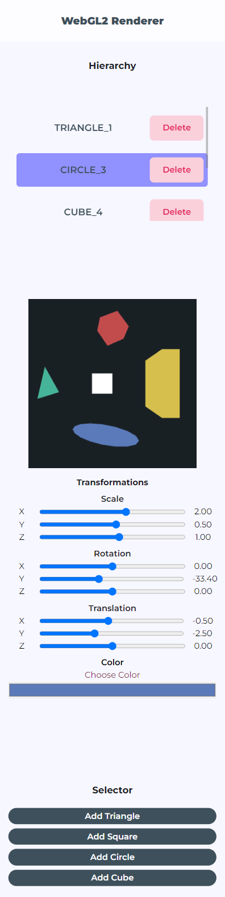

# WebGL2 Renderer

## Omar Vidaña Rodríguez

*This project was created using **bun.js** and **Vite**.*

First Midterm project for Advanced Computer Graphics course. This solutions allows for rendering:

* **Triangles**
* **Squares**
* **Circles**
* **Cubes**

And modifying properties such as scale, rotation, translation and color.

<div style="display: flex; justify-content: center; align-items: center;">
    
    
</div>

Compatible with desktop view and mobile view.

## Instalation and Use

1. Clone this repository:

    ```sh
    git clone https://github.com/OmVidana/Typescript-WebGL2-Renderer.git
    ```

2. Install the dependencies using *Bun.js*:

    ```sh
    bun install
    ```

3. To start dev environment run the following command:

    ```sh
    bun run dev
    ```

4. For building the project use:

   ```sh
    bun run build
    ```

5. Preview the build with:

   ```sh
    bun run preview
    ```

## Use

1. **Add Objects**: Use one of the four available buttons for creating a figure.
2. **Selecting and Editing an Object**: Click on the element added to the hierarchy in order to:
    * Delete it.
    * Change its name.
    * Apply transformations.

## Libraries used

* [WebGL2](https://www.khronos.org/webgl/)
* [glMatrix](http://glmatrix.net/)
* [Tailwind CSS](https://tailwindcss.com/)

## Credits

* **Profesor**: José Carlos Vargas Del Río
* **Inspiration**: [cuon-utils.js - yukoba](https://github.com/yukoba/WebGLBook/blob/master/lib/cuon-utils.js) (2012 kanda and matsuda)